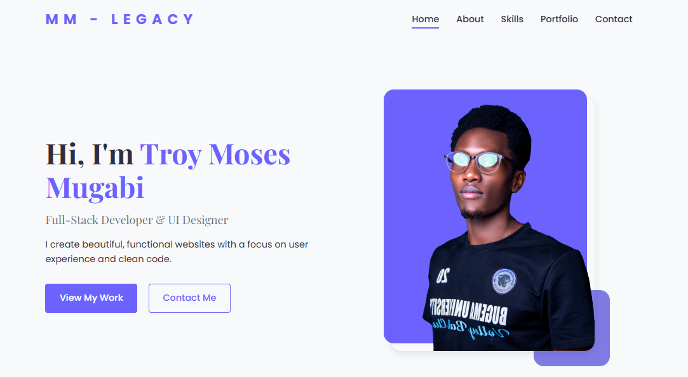

# My Modern Creative Portfolio

Welcome to my responsive, modern portfolio website built with HTML, CSS, and JavaScript.

## Features

- **Responsive Design**: Works on all device sizes
- **Modern UI**: Clean, professional design with animations
- **Interactive Elements**: 
  - Smooth scrolling navigation
  - Portfolio filtering
  - Animated skill bars
  - Contact form

## Technologies Used

- **HTML5**: Semantic markup
- **CSS3**: Flexbox, Grid, animations, and transitions
- **JavaScript**: DOM manipulation, event handling
- **Font Awesome**: Icons
- **Google Fonts**: Typography

## Installation

No installation required. Just open `index.html` in your browser.

## Usage

1. Clone or download the repository
2. Open `index.html` in your preferred browser
3. Navigate through the different sections using the menu or scroll

## Customization

To customize the portfolio with your own information:

1. Replace the placeholder images in `assets/images/` with your own
2. Update the text content in `index.html`
3. Modify the skills and percentages in both HTML and CSS
4. Add your own portfolio projects in the portfolio section
5. Update the contact information in the contact section

## Color Scheme

The default color scheme uses:

- Primary: `#6c63ff` (Purple)
- Secondary: `#4d44db` (Dark Purple)
- Dark: `#2f2e41` (Dark Blue)
- Light: `#f8f9fa` (Light Gray)

You can change these in the `:root` CSS variables at the top of `style.css`.

## Fonts

The portfolio uses:

- **Poppins**: For body text
- **Playfair Display**: For headings

Both are loaded from Google Fonts.

## License

This project is open source and available under the [MIT License](LICENSE).

## Contributing

Contributions are welcome! Please open an issue or submit a pull request.

## Contact

For questions or feedback, please open an issue on GitHub.